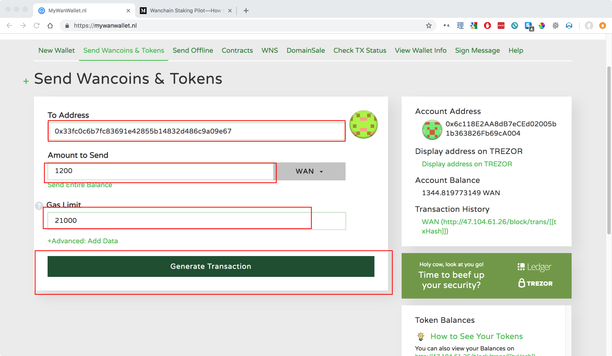
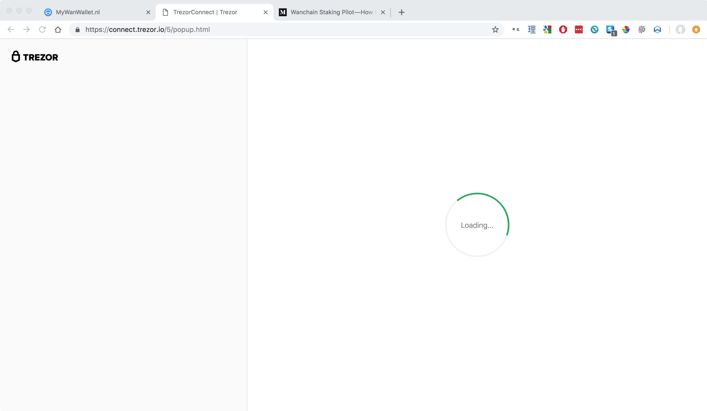
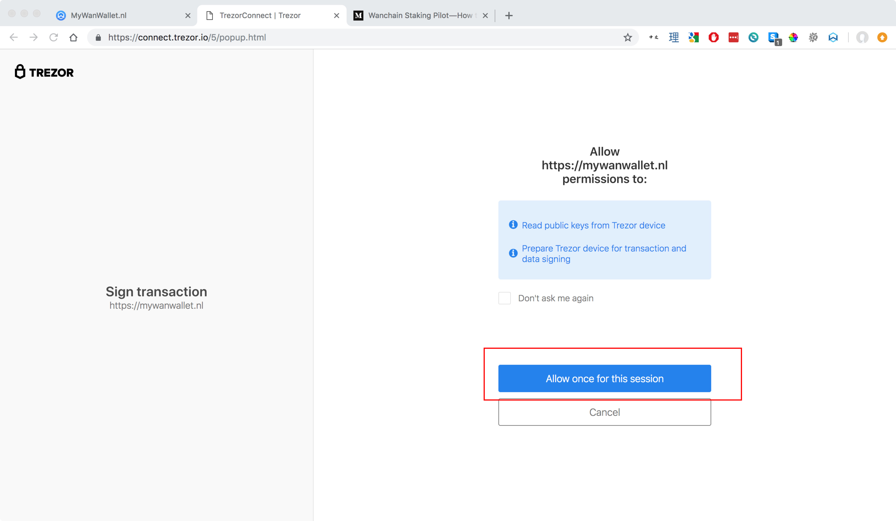
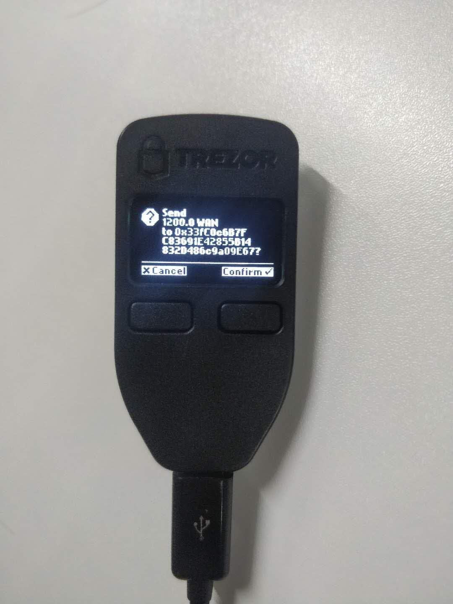
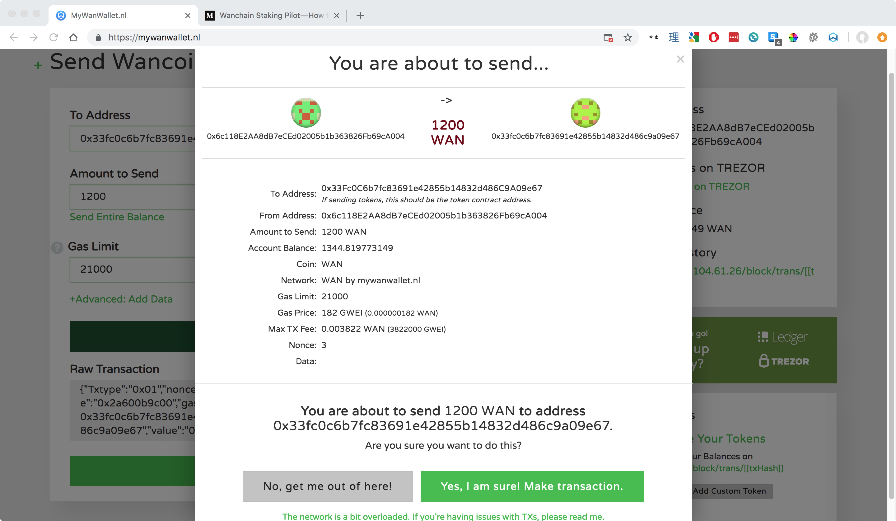

# MyWanWallet Support

*DISCLAIMER: MyWanWallet.nl is a Wanchain community project. The Wanchain Foundation does not maintain the project or make any guarantees about its security or functionality, and takes no responsibility for any loss or damages incurred through use of MyWanWallet.nl.*

## Trezor Instructions

1. Connect your Trezor to your PC by USB and navigate to `https://mywanwallet.nl/`. Double check the address to make sure that it is correct, including 'https' and the 'nl' domain.  

2. Double check that you are on the Wanchain Mainnet and not on the Testnet or any other network. 

3. Select "Trezor" from the radio menu

4. Click "Connect to Trezor" 

  

5. Allow your browser to redirect you by popup to the url beginning with `https://connect.trezor.io`.

6. Wait for the page to load.

  

7. Click the blue button with the text "Allow once for this session" to allow MyWanWallet.nl permission to read the public keys from your Trezor device.

  

8. Click the green button with the text "Export" to export your Trezor device's public keys to MyWanWallet.

  

9. Using the numbers displayed on your Trezor device together with the number pad displayed in your browser, input your Trezor device's passcode in order to export your public key.
  
   

10. Select the address with the WAN balance you would like to use, and then click the button with the text "Unlock your Wallet".
  

11. You will now be redirected to your wallet details on MyWanWallet.
  

12. Copy and paste stake smart contract address in the "To" address field. The address is `0x33fc0c6b7fc83691e42855b14832d486c9a09e67` you can also find the address at Wanchain's official Medium account [here](https://medium.com/wanchain-foundation/wanchain-staking-pilot-how-to-participate-and-earn-wan-infographic-bc644981ca08). And we encourage you to confirm the address using the [video](https://www.youtube.com/watch?v=2gtdAxMpMzE) provided by Wanchain founder and CEO Jack Lu. 

13. Enter your bid for the staking program in the "Amount to Send" field. There is a 1000 WAN minimum stake, and there is no maximum, however you will only earn stake on up to 5000 WAN. Any amount over 5000 just increases your chance to be selected for the staking program, but you will not earn rewards on amounts over 5000. 

14. You may leave the Gas Limit at the default of 21000, and then click click the green "Generate Transaction" button to generate your transaction. 

  

15. Allow your browser to redirect you by popup to the url beginning with `https://connect.trezor.io` and wait for the page to load.
  

7. Click the blue button with the text "Allow once for this session" to allow MyWanWallet.nl permission to sign the transaction with your Trezor device.

  

8. Confirm the transaction on your Trezor device by clicking the right button:

    

9. Confirm again:

    

10. You will be redirected back to the MyWanWallet page where you should click the green button with the text 'Send Transaction' to begin sending your transaction.

  

11. Finally a pop-up window will display all of your transaction details. Please check all the details to make sure they are correct, and click the green button with the text "Yes, I am sure! Make transaction." to complete your transaction.

  

12. Pay attention to the results of the bidding on the leaderboard at the [Wanchain Explorer website](https://www.wanscan.org/). The results will be finalized on the 31st of March. 