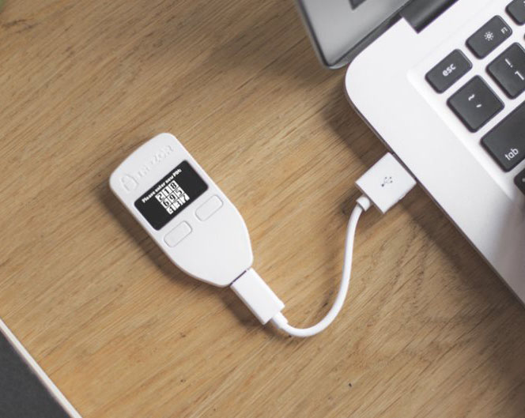
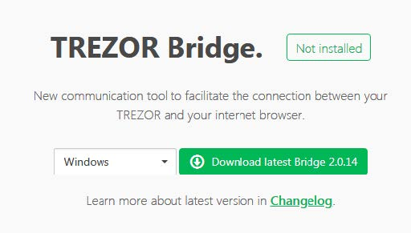
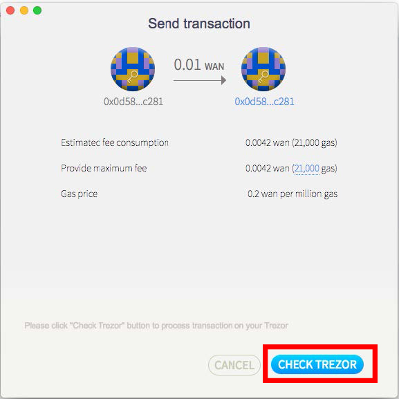

# Trezor Support
*Deprecated - Since Trezor's switch from HID to WebUSB in version 1.7.1, the Wanchain official desktop wallet is no longer supported. If you are currently using Trezor, we recommend connecting through [MyWanWallet](https://mywanwallet.nl/) or [WanMask](https://wanmask.io/)*
## Requirements
|**Hardware/Software**|**Version**|
|:---|:---| 
| [Wanchain GUI wallet](https://wanchain.org/products) | 1.0.5 or later  |
| [Gwan](https://github.com/wanchain/go-wanchain) |   1.0.5 or later|  
| Trezor One (Trezor T not supported) |   1.6.2 to 1.7.1|  

*You can find instructions for updating your Trezor firmware [here](https://wiki.trezor.io/index.php?title=User_manual:Updating_your_Trezor%27s_firmware&ModelType=1)*

## Step by step guide

1. Connect Trezor wallet to your computer's USB port  

  

2. Unlock Trezor wallet by following instructions on Trezor's [official website](https://wallet.trezor.io)  

  

3. Open the Wanchain GUI wallet. The Wanchain GUI wallet should indicate **"Trezor Account Connected"** and display an overview of accounts associated with the connected Trezor wallet.  

  

4. To send WAN from a Trezor wallet, first click the "Transfer" button on the right side of the account you want to send WAN from, it will take you to the transfer page (shown below). Enter the recipient address, choose transaction amount and transaction fee. Once all the fields are filled and verified, click "SEND".  

  

5. Click "CHECK TREZOR" button to send transaction information to the Trezor wallet device.  

  

6. Confirm the transaction by selecting "Confirm" on the Trezor wallet device.

    *Confirm*

    

    *Confirm again*

    

7. Check transaction details. Once the transaction has been successfully confirmed, Wanchain GUI wallet will redirect you to the "Account Details" page where the transaction information will be listed in the "Transaction History" section.

  

