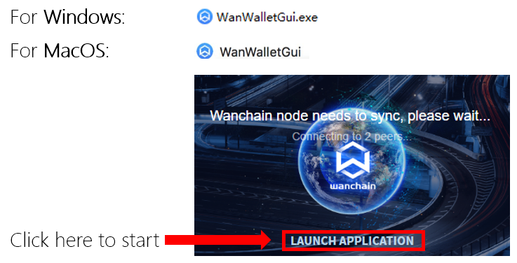
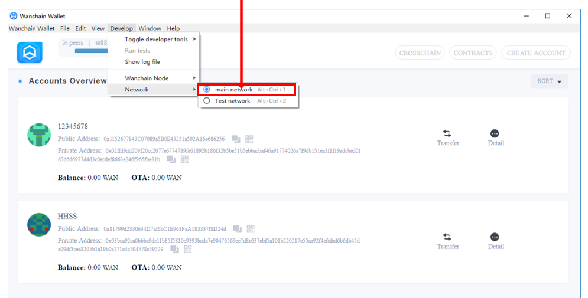
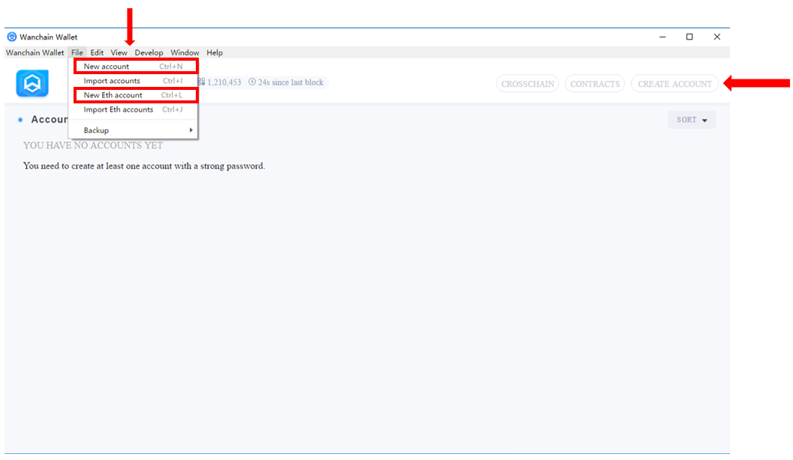

# Install Wallet
## 1) Download

Download Wanwallet 2.0 installation file from https://wanchain.org/product

*Wanwallet 2.0 supports **Linux, Windows, and OSX**, please download corresponding installation file for your OS.

## 2) Verify install package 

**Windows**

The following command will display SHA256 hash value on a Windows operating system (“SHA256” parameter is case sensitive on certain versions of Windows):

`certutil -hashfile <path><filename> SHA256`

**Linux**

The following command will display SHA256 hash value on a Linux operating system:

`sha256sum <path>/<filename>`

**OSX**

The following command will display SHA256 hash value on a Mac operating system.

`openssl dgst -sha256 <path>/<filename>`

## 3) Installation and launch

Extract the file, run, wallet will begin to sync. Click the "LAUNCH APPLICATION" button to start the wallet

For Linux users: 

Setup by CLI: `sudo dpkg -i WanWalletGui-linux64-2.X.X.deb`

* Start by CLI for main network: `wanwalletgui`                

* Start by CLI for test network: `wanwalletgui --network testnet`

* Or click Wanwalletgui to start under `/usr/local/bin/`

## 4) Toggle main / test network

Wanwallet 2.0 works with both main and test networks of Wanchain and Ethereum.

Below you can see the Wanchain accounts overview page (also the default start-up page), you can access it anytime by clicking on the Wanchain logo on the upper-left corner.   

Use the menu option below (Develop--->Network) to switch between main network (default network) and test network. WARNING: Never send assets from the main network to a test network address, as they will then be lost forever.

## 5) Create / Import accounts

These 2 options allow you to create new WAN or new ETH account. 

The "CREATE ACCOUNT" button in the upper-right corner only creates new WAN account

You can also import an existing WAN or ETH account using a wallet keystore file

    File -> Import accounts -> Drag & Drop -> Done

## 6) Backup Account

The keystore is where your account details are stored. WARNING: If you lose your keystore files and have no other backup your assets will be lost forever, and no one, including the team at Wanchain, will be able to restore them. Therefore we strongly recommend you backup all keystore files in a place you trust and won’t forget (offline PC device or storage device, etc.)

Do NOT share or reveal your keystore information with anyone, as they will then have full access to all of your funds. If you think your keystore has been leaked to any 3rd party, immediately transfer your assets to a new account.

To find your backup files, navigate as follows.

    File -> Backup -> Accounts -> Keystore

## 7) Backup Application Data

To backup your application data, navigate as follows.

*Click File -> Backup -> Application Data*

You will see files under **WanWalletGui** by default. Please select them all and make copy to a safe place where you can trust.

The Accounts & Application Data stores all your public transaction records, private transaction records and OTA balance. If you delete these files , you will not lose your assets but you will not be able to see your assets at your current wallet at meantime unless you back them up in advance . However, you can always call it back via “Import Account” which we have demonstrated to you in above content.

